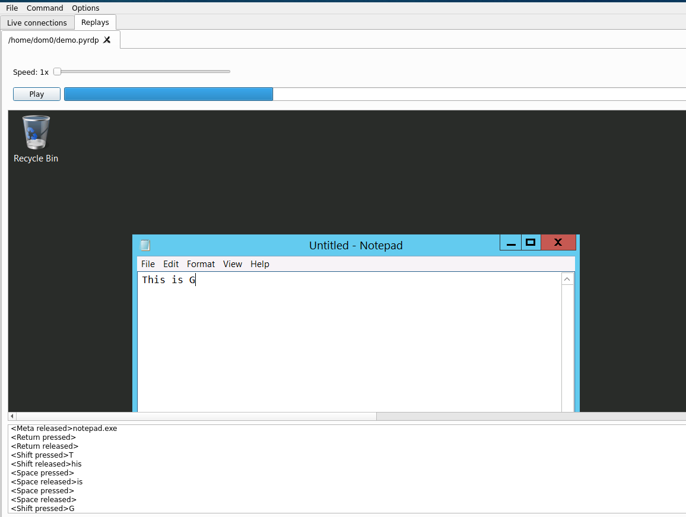
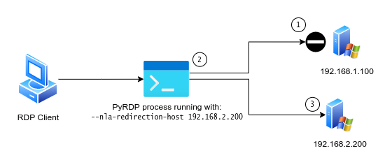
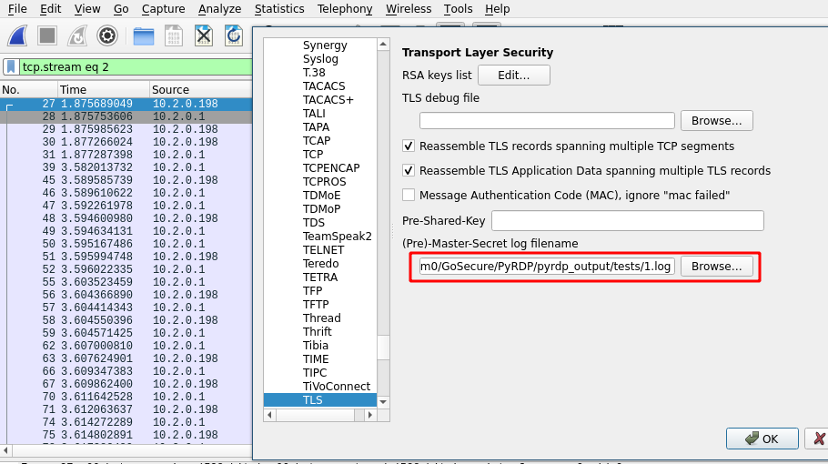
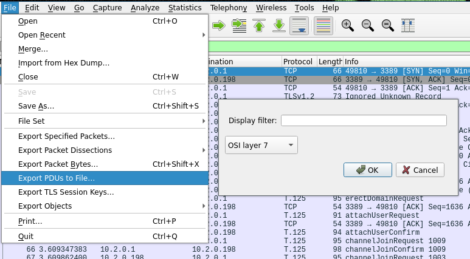
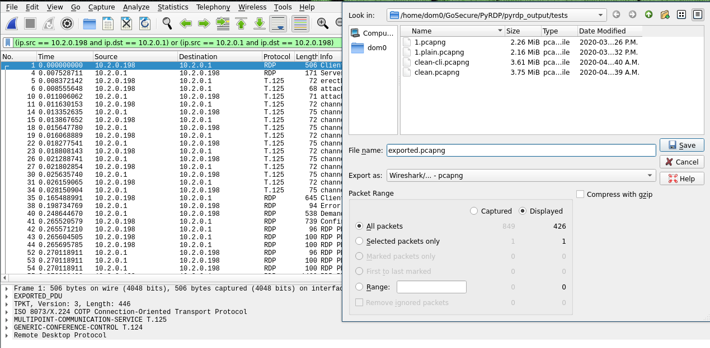

# PyRDP


[](https://www.blackhat.com/us-19/arsenal/schedule/index.html)
[](https://www.blackhat.com/us-21/arsenal/schedule/index.html)

PyRDP is a Python Remote Desktop Protocol (RDP) Monster-in-the-Middle (MITM) tool and library.


It features a few tools:
- RDP Monster-in-the-Middle
    - Logs plaintext credentials or NetNTLM hashes used when connecting
    - Steals data copied to the clipboard
    - Saves a copy of the files transferred over the network
    - Crawls shared drives in the background and saves them locally
    - Saves replays of connections so you can look at them later
    - Runs console commands or PowerShell payloads automatically on new connections
- RDP Player:
    - See live RDP connections coming from the MITM
    - View replays of RDP connections
    - Take control of active RDP sessions while hiding your actions
    - List the client's mapped drives and download files from them during active sessions
- Converter tool:
    - Convert RDP replays to videos for easier sharing
    - Convert RDP replays to a sequence of low-level events serialized in JSON format
    - Convert PCAPs to replays, videos or JSON events
    - Convert decrypted PCAPs (L7 PDUs) to replays, videos or JSON events
- RDP Certificate Cloner:
    - Create a self-signed X509 certificate with the same fields as an RDP server's certificate

PyRDP was [introduced in 2018](https://www.gosecure.net/blog/2018/12/19/rdp-man-in-the-middle-smile-youre-on-camera) in
which we [demonstrated that we can catch a real threat actor in
action](https://www.youtube.com/watch?v=eB7RC9FmL6Q). This tool is being developed with both pentest and malware
research use cases in mind.





## Table of Contents
- [Supported Systems](#supported-systems)
- [Installing](#installing)
  * [Using the Docker Image](#using-the-docker-image)
  * [From Git Source](#from-git-source)
  * [Installing on Windows](#installing-on-windows)
  * [Building the Docker Image](#building-the-docker-image)
- [Using PyRDP](#using-pyrdp)
  * [Using the PyRDP Monster-in-the-Middle](#using-the-pyrdp-monster-in-the-middle)
  * [Using the PyRDP Player](#using-the-pyrdp-player)
  * [Using the PyRDP Certificate Cloner](#using-the-pyrdp-certificate-cloner)
  * [Using PyRDP Convert](#using-pyrdp-convert)
  * [Configuring PyRDP](#configuring-pyrdp)
  * [Advanced Usage](#advanced-usage)
  * [Docker Specific Usage Instructions](#docker-specific-usage-instructions)
- [PyRDP Lore](#pyrdp-lore)
- [Contributing to PyRDP](#contributing-to-pyrdp)
- [Acknowledgements](#acknowledgements)


## Supported Systems
PyRDP should work on Python 3.6 and up on the x86-64, ARM and ARM64 platforms.

This tool has been tested to work on Python 3.6 on Linux (Ubuntu 18.04, 20.04), Raspberry Pi and Windows
(see section [Installing on Windows](#installing-on-windows)). It has not been tested on macOS.

## Installing

### Using the Docker Image

This is the easiest installation method if you have docker installed and working.

```
docker pull gosecure/pyrdp:latest
```

As an alternative we have a slimmer image without the GUI and ffmpeg dependencies.
This is the only provided image on ARM platforms.

```
docker pull gosecure/pyrdp:latest-slim
```

You can find the list of all our Docker images [on the gosecure/pyrdp DockerHub page](https://hub.docker.com/r/gosecure/pyrdp/tags).
The `latest` tag refers to the latest released version while the `master` tag is the docker image built out of our `master` branch.

### From Git Source

We recommend installing PyRDP in a
[virtualenv environment](https://packaging.python.org/guides/installing-using-pip-and-virtual-environments/)
to avoid dependency issues.

First, make sure to install the prerequisite packages (on Ubuntu). We provide two types of installs a full one and a
slim one. Install the dependencies according to your use case.

```
# Full install (GUI, transcoding to MP4)
sudo apt install python3 python3-pip python3-dev python3-setuptools python3-venv \
        build-essential python3-dev git openssl \
        libgl1-mesa-glx \
        libnotify-bin \
        libxkbcommon-x11-0 libxcb-xinerama0 \
        libavformat-dev libavcodec-dev libavdevice-dev \
        libavutil-dev libswscale-dev libswresample-dev libavfilter-dev

# Slim install (no GUI, no transcoding)
sudo apt install python3 python3-pip python3-setuptools python3-venv \
        build-essential python3-dev git openssl
```

Grab PyRDP's source code:

```
git clone https://github.com/gosecure/pyrdp.git
```

Then, create your virtual environment in the `venv` directory inside PyRDP's directory:

```
cd pyrdp
python3 -m venv venv
```

*DO NOT* use the root PyRDP directory for the virtual environment folder (`python3 -m venv .`). You will make a mess,
and using a directory name like `venv` is more standard anyway.

Before installing the dependencies, you need to activate your virtual environment:

```
source venv/bin/activate
```

Finally, you can install the project with Pip:

```
pip3 install -U pip setuptools wheel

# Without GUI and ffmpeg dependencies
pip3 install -U -e .

# With GUI and ffmpeg dependencies
pip3 install -U -e '.[full]'
```

This should install the dependencies required to run PyRDP. If you choose to
install without the GUI or ffmpeg dependencies, it will not be possible to use
`pyrdp-player` without headless mode (`--headless`) or `pyrdp-convert` to produce video output.

If you ever want to leave your virtual environment, you can simply deactivate it:

```
deactivate
```

Note that you will have to activate your environment every time you want to have the PyRDP scripts available as shell
commands.

### Installing on Windows

The steps are almost the same. There are two additional prerequisites.

1. Any C compiler
2. [OpenSSL](https://wiki.openssl.org/index.php/Binaries). Make sure it is reachable from your `$PATH`.

Then, create your virtual environment in PyRDP's directory:

```
cd pyrdp
python3 -m venv venv
```

*DO NOT* use the root PyRDP directory for the virtual environment folder (`python3 -m venv .`). You will make a mess,
and using a directory name like `venv` is more standard anyway.

Before installing the dependencies, you need to activate your virtual environment:

```
venv\Scripts\activate
```

Finally, you can install the project with Pip:

```
pip3 install -U pip setuptools wheel
pip3 install -U -e ".[full]"
```

This should install all the dependencies required to run PyRDP.

If you ever want to leave your virtual environment, you can simply deactivate it:

```
deactivate
```

Note that you will have to activate your environment every time you want to have the PyRDP scripts available as shell
commands.

### Building the Docker Image

First of all, build the image by executing this command at the root of PyRDP (where Dockerfile is located):

```
docker build -t pyrdp .
```

As an alternative we have a slimmer image without the GUI and ffmpeg dependencies:

```
docker build -f Dockerfile.slim -t pyrdp .
```

Afterwards, you can execute PyRDP by invoking the `pyrdp` docker container. See [Usage instructions](#using-pyrdp) and the [Docker specific instructions](#docker-specific-usage-instructions) for details.

Cross-platform builds can be achieved using `buildx`:

```
docker buildx create --name mybuilder --use --platform linux/amd64,linux/arm64
docker buildx inspect --bootstrap
docker buildx build --platform linux/arm,linux/amd64 -t pyrdp -f Dockerfile.slim .
```


## Using PyRDP

### Using the PyRDP Monster-in-the-Middle
Use `pyrdp-mitm.py <ServerIP>` or `pyrdp-mitm.py <ServerIP>:<ServerPort>` to run the MITM.

Assuming you have an RDP server running on `192.168.1.10` and listening on port 3389, you would run:

```
pyrdp-mitm.py 192.168.1.10
```

When running the MITM for the first time a directory called `pyrdp_output/`
will be created relative to the current working directory.
Here is an example layout of that directory:

```
pyrdp_output/
├── certs
│   ├── WinDev2108Eval.crt
│   └── WinDev2108Eval.pem
├── files
│   ├── e91c6a5eb3ca15df5a5cb4cf4ebb6f33b2d379a3a12d7d6de8c412d4323feb4c
├── filesystems
│   ├── Kimberly835337
│   │   └── device1
│   └── Stephen215343
│       ├── device1
│       └── device2
|           └── Users/User/3D Objects/desktop.ini
├── logs
│   ├── crawl.json
│   ├── crawl.log
│   ├── mitm.json
│   ├── mitm.log
│   ├── mitm.log.2021-08-26
│   ├── ntlmssp.log
│   ├── player.log
│   └── ssl.log
└── replays
    ├── rdp_replay_20210826_12-15-33_512_Stephen215343.pyrdp
    └── rdp_replay_20211125_12-55-42_352_Kimberly835337.pyrdp
```

* `certs/` contains the certificates generated stored using the `CN` of the certificate as the file name
* `files/` contains all files captured and are deduplicated by saving them using the SHA-256 hash of the content as the filename
* `filesystems/` contains a recreation of the filesystem of the targets classified by session IDs.
   To save space on similar sessions, files are symbolic links to the actual files under `files/`.
* `logs/` contains all the various logs with most in both JSON and plaintext formats:
  * `crawl`: the file crawler log
  * `mitm`: the main MITM log
  * `ntlmssp.log`: the captured NetNTLM hashes
  * `player.log`: the player log
  * `ssl.log`: the TLS master secrets stored in a format compatible with Wireshark
* `replays/` contains all the previously recorded PyRDP sessions with timestamps and session IDs in the filename

#### Specifying the private key and certificate
If key generation didn't work or you want to use a custom key and certificate, you can specify them using the
`-c` and `-k` arguments:

```
pyrdp-mitm.py 192.168.1.10 -k private_key.pem -c certificate.pem
```

##### Monster-in-the-Middle Network Level Authentication (NLA) connections
Network Level Authentication (NLA) is a security feature available since Windows Vista that adds security to RDP connections.
NLA relies on the new security support provider CredSSP and is sometimes referred by that name.
A server that enforces NLA is harder to attack.
There are three different strategies that can be used:

* Obtain the server's certificate and private key
* Using a host redirection feature
* Capture the client's NetNTLMv2 hash and crack it

###### Monster-in-the-Middle NLA
If we have access to the server's certificate and private key, we can successfully MITM RDP even if NLA is enforced.
We [documented this attack in our 1.0 release blog post](https://www.gosecure.net/blog/2020/10/20/announcing-pyrdp-1-0/).
Instructions to [extract the RDP certificate and private key](https://github.com/GoSecure/pyrdp/blob/master/docs/cert-extraction.md) are available on our GitHub.

With the certificate and private key accessible, you just need to set the authentication to `ssp` by adding this on the `pyrdp-mitm.py` command-line:
```
--auth ssp -c <certificate.pem> -k <private-key.pem>
```
This will enable the possibility to intercept NLA-enforced connections.

###### Alternative host redirection when NLA enforced by server


When PyRDP connects to the destination RDP server (1) if that server enforces NLA then PyRDP (2) will replace the connection to go to another host of your chosing (3) instead.

For example, this can be used to redirect to a server that is known not to enforce NLA or it could even redirect to a VM in the control of an attacker.

To enable this feature specify the alternative host's address and port like this:
```
--nla-redirection-host 192.168.1.12 --nla-redirection-port 3389
```

This feature was introduced in PyRDP 1.1.0.

###### Capturing NetNTLMv2 hashes
NetNTLMv2 hashes are useful for an attacker as they can be cracked relatively easily allowing attackers to leverage legitimate RDP access or attempt credentials stuffing.
Starting with version 1.1.0, PyRDP has the ability to capture the client's NetNTLMv2 hashes via an NLA (CredSSP) connection by carrying the negotiation and capturing the NTLMSSP authentication messages.
In version 1.2.0 that support was extended to work even if we don't have the server's certificate and private key meaning that the connection will not be successfully MITM'ed.
This is similar to what [Responder](https://github.com/lgandx/Responder) does with RDP.
The captured NetNTLMv2 hash can be found in the `ntlmssp.log` log file and it's
formatted so cracking tools like [John The Ripper](https://www.openwall.com/john/) or [hashcat](https://hashcat.net/hashcat/) can ingest it.

This technique has been described in details in a blog post: [Capturing RDP NetNTLMv2 Hashes: Attack details and a Technical How-To Guide](https://www.gosecure.net/blog/2022/01/17/capturing-rdp-netntlmv2-hashes-attack-details-and-a-technical-how-to-guide/)

This feature is compatible with `--auth ssp` but incompatible with `--nla-redirection-host`.

#### Connecting to the PyRDP player
If you want to see live RDP connections through the PyRDP player, you will need to specify the IP address and port on which the
player is listening using the `-i` and `-d` arguments. Note: the port argument is optional, the default port is 3000.

```
pyrdp-mitm.py 192.168.1.10 -i 127.0.0.1 -d 3000
```

##### Connecting to a PyRDP player when the MITM is running on a server
If you are running the MITM on a server and still want to see live RDP connections, you should use
[SSH remote port forwarding](https://www.booleanworld.com/guide-ssh-port-forwarding-tunnelling/)
to forward a port on your server to the player's port on your machine. Once this is done, you pass `127.0.0.1` and the forwarded
port as arguments to the MITM. For example, if port 4000 on the server is forwarded to the player's port on your machine,
this would be the command to use:

```
pyrdp-mitm.py 192.168.1.10 -i 127.0.0.1 -d 4000
```

#### Running payloads on new connections
PyRDP has support for running console commands or PowerShell payloads automatically when new connections are made.
Due to the nature of RDP, the process is a bit hackish and is not always 100% reliable. Here is how it works:

1. Wait for the user to be authenticated.
2. Block the client's input / output to hide the payload and prevent interference.
3. Send a fake Windows+R sequence and run `cmd.exe`.
4. Run the payload as a console command and exit the console. If a PowerShell payload is configured, it is run with `powershell -enc <PAYLOAD>`.
5. Wait a bit to allow the payload to complete.
6. Restore the client's input / output.

For this to work, you need to set 3 arguments:

- the payload
- the delay before the payload starts
- the payload's duration

##### Setting the payload
You can use one of the following arguments to set the payload to run:

- `--payload`, a string containing console commands
- `--payload-powershell`, a string containing PowerShell commands
- `--payload-powershell-file`, a path to a PowerShell script

##### Choosing when to start the payload
For the moment, PyRDP does not detect when the user is logged on.
You must give it an amount of time to wait for before running the payload.
After this amount of time has passed, it will send the fake key sequences and expect the payload to run properly.
To do this, you use the `--payload-delay` argument. The delay is in milliseconds.
For example, if you expect the user to be logged in within the first 5 seconds, you would use the following arguments:

```
--payload-delay 5000
```

This could be made more accurate by leveraging some messages exchanged during RDPDR initialization.
See [this issue](https://github.com/GoSecure/pyrdp/issues/98) if you're interested in making this work better.

##### Choosing when to resume normal activity
Because there is no direct way to know when the console has stopped running, you must tell PyRDP how long you want
the client's input / output to be blocked. We recommend you set this to the maximum amount of time you would expect the
console that is running your payload to be visible. In other words, the amount of time you would expect your payload to
complete.
To set the payload duration, you use the `--payload-duration` argument with an amount of time in milliseconds.
For example, if you expect your payload to take up to 5 seconds to complete, you would use the following argument:

```
--payload-duration 5000
```

This will block the client's input / output for 5 seconds to hide the console and prevent interference.
After 5 seconds, input / output is restored back to normal.

#### Other MITM arguments
Run `pyrdp-mitm.py --help` for a full list of arguments.

##### `--no-downgrade`

This argument is useful when running PyRDP in Honeypot scenarios to avoid scanner fingerprinting.
When the switch is enabled, PyRDP will not downgrade unsupported extensions and let the traffic through
transparently. The player will likely not be able to successfully replay video traffic, but the following
supported channels should still be accessible:

- Keystroke recording
- Mouse position updates
- Clipboard access (passively)
- Drive access (passively)

This feature is still a work in progress and some downgrading is currently unavoidable to allow the connection
to be established. The following are currently not affected by this switch and will still be disabled:

- FIPS Encryption
- Non-TLS encryption protocols
- ClientInfo compression
- Virtual Channel compression

**NOTE**: If being able to eventually replay the full session is important, a good solution is to record the raw
RDP traffic using Wireshark and keep the TLS master secrets. Whenever PyRDP adds support for additional extensions,
it would then become possible to extract a valid RDP replay file from the raw network capture.

##### `--transparent`

Tells PyRDP to attempt to spoof the source IP address of the client so that the server sees the real IP
address instead of the MITM one. This option is only useful in certain scenarios where the MITM is physically
a gateway between clients and the server and sees all traffic.
[Specific examples can be found here.](docs/transparent-proxy.md)

**NOTE**: This requires root privileges, only works on Linux and requires manual firewall configuration to ensure
that traffic is routed properly.

##### `--no-gdi`: Disable Accelerated Graphics Pipeline

PyRDP downgrades video to the the most recent graphics pipeline that it supports. This switch explicitly tells the
MITM to not use the [Graphics Device Interface Acceleration][gdi] extensions to stream video. The advantage of this mode
is a significant reduction in required bandwidth for high resolution connections.

Note that some GDI drawing orders are currently unimplemented because they appear to be unused. If you have a replay
which contains any unsupported or untested order, do not hesitate to share it with the project maintainers so that
support can be added as required. (Make sure that the trace does not contain sensitive information)

[gdi]: https://docs.microsoft.com/en-us/openspecs/windows_protocols/ms-rdpegdi/745f2eee-d110-464c-8aca-06fc1814f6ad

### Using the PyRDP Player
Use `pyrdp-player.py` to run the player.

#### Playing a replay file
You can use the menu to open a new replay file: File > Open.

You can also open replay files when launching the player:

```
pyrdp-player.py <FILE1> <FILE2> ...
```

#### Listening for live connections
The player always listens for live connections. By default, the listening port is 3000, but it can be changed:

```
pyrdp-player.py -p <PORT>
```

#### Changing the listening address
By default, the player only listens to connections coming from the local machine. We do not recommend opening up the player
to other machines. If you still want to change the listening address, you can do it with `-b`:

```
pyrdp-player.py -b <ADDRESS>
```

#### Other player arguments
Run `pyrdp-player.py --help` for a full list of arguments.

### Using the PyRDP Certificate Cloner

NOTE: Using this tool is optional.
Since version 1.0 PyRDP generate certificates on-the-fly exactly like this tool would do.

The PyRDP certificate cloner creates a brand new X509 certificate by using the values from an existing RDP server's
certificate. It connects to an RDP server, downloads its certificate, generates a new private key and replaces the
public key and signature of the certificate using the new private key. This can be used in a pentest if, for example,
you're trying to trick a legitimate user into going through your MITM. Using a certificate that looks like a legitimate
certificate could increase your success rate.

#### Cloning a certificate
You can clone a certificate by using `pyrdp-clonecert.py`:

```
pyrdp-clonecert.py 192.168.1.10 cert.pem -o key.pem
```

The `-o` parameter defines the path name to use for the generated private key.

#### Using a custom private key
If you want to use your own private key instead of generating a new one:

```
pyrdp-clonecert.py 192.168.1.10 cert.pem -i input_key.pem
```

#### Other cloner arguments
Run `pyrdp-clonecert.py --help` for a full list of arguments.

### Using PyRDP Convert

`pyrdp-convert` is a helper script that performs several useful conversions from various input formats to various output formats.
The script has the best chance of working on traffic captured by PyRDP due to unsupported RDP protocol features that might be used in a non-intercepted connection.

The following inputs are supported:

- Network Capture (PCAP) with TLS master secrets (less reliable)
- Network Capture (PCAP) in Exported PDUs Layer 7 format (more reliable)
- Replay file generated by PyRDP

The following outputs are supported:

- MP4 video file
- JSON: a sequence of low-level events serialized in JSON format
- Replay file compatible with `pyrdp-player.py`

Encrypted (TLS) network captures require the TLS master secrets to be provided using `--secrets ssl.log`.

```
# Export the session coming client 10.2.0.198 to a .pyrdp file.
pyrdp-convert.py --src 10.2.0.198 --secrets ssl.log -o path/to/output capture.pcap

# Or as an MP4 video
pyrdp-convert.py --src 10.2.0.198 --secrets ssl.log -o path/to/output -f mp4 capture.pcap

# List the sessions in a network trace, along with the decryptable ones.
pyrdp-convert.py --list-only capture.pcap
```

Note that MP4 conversion requires libavcodec and ffmpeg, so this may require extra steps on Windows.

Manually decrypted network traces can be exported from Wireshark by selecting `File > Export PDUs` and selecting `OSI Layer 7`.

First, make sure you configured wireshark to load TLS secrets:



Next, export OSI Layer 7 PDUs:



And optionally, filter down the trace to contain only the conversation(s) of interest by applying a
display filter and clicking `File > Export Specified Packets...`



Now this trace can be used directly in `pyrdp-convert`.


### Configuring PyRDP

Most of the PyRDP configuration is done through command line switches, but it is also possible to use a
configuration file for certain settings such as log configuration.

The default configuration files used by PyRDP are located in [mitm.default.ini](pyrdp/mitm/mitm.default.ini)
and [player.default.ini](pyrdp/player/player.default.ini). Both files are thoroughly documented and can serve
as a basis for further configuration.

In the future there are plans to support other aspects of PyRDP configuration through those configuration files.

### Advanced Usage

#### Using PyRDP as a Library
If you're interested in experimenting with RDP and making your own tools, head over to our
[documentation section](docs/README.md) for more information.

#### Using PyRDP with twistd
The PyRDP MITM component was also implemented as a twistd plugin.
This enables you to run it in debug mode and allows you to get an interactive debugging repl (pdb) if you send a `SIGUSR2` to the twistd process.
See the [twistd documentation](docs/twistd.md) for more information.

#### Using PyRDP with Bettercap
We developped our own Bettercap module, `rdp.proxy`, to monster-in-the-middle all RDP connections
on a given LAN. Check out [this document](docs/bettercap-rdp-mitm.md) for more information.

### Docker Specific Usage Instructions

Since docker restricts the interactions with the host system (filesystem and network), the PyRDP docker image must be run with some parameters depending on your use case. This section documents those parameters.

We refer to the publicly provided docker image but if you [built your own](#building-the-docker-image) replace `gosecure/pyrdp` with the name of your locally built image.

#### Mapping a Listening Port

In most of the monster-in-the-middle cases you will need to map a port of your host into the docker image. This is achieved by the `--publish` (`-p`) parameters applied to `docker run`.

For example, to listen on 3389 (RDP's default port) on all interfaces, use:

```
docker run -p 3389:3389 gosecure/pyrdp pyrdp-mitm.py 192.168.1.10
```

#### Logs and Artifacts Storage

To store the PyRDP output permanently (logs, files, etc.), add the `--volume` (`-v`) option to the previous command. In this example we store the files relatively to the current directory in `pyrdp_output`:

```
docker run -v $PWD/pyrdp_output:/home/pyrdp/pyrdp_output -p 3389:3389 gosecure/pyrdp pyrdp-mitm.py 192.168.1.10
```

Make sure that your destination directory is owned by a user with a UID of 1000, otherwise you will get permission denied errors.
If you are the only non-root user on the system, usually your user will be assigned UID 1000.

#### Logging the host IP address

If you want PyRDP to log the host IP address in its logs, you can set the `HOST_IP` environment variable when using `docker run`:

```
docker run -p 3389:3389 -e HOST_IP=192.168.1.9 gosecure/pyrdp pyrdp-mitm.py 192.168.1.10
```

#### Using the GUI Player in Docker

Using the player will require you to export the `DISPLAY` environment variable from the host to the docker.
This redirects the GUI of the player to the host screen.
You also need to expose the host's network and prevent Qt from using the MIT-SHM X11 Shared Memory Extension.
To do so, add the `-e` and `--net` options to the run command:

```
docker run -e DISPLAY=$DISPLAY -e QT_X11_NO_MITSHM=1 --net=host gosecure/pyrdp pyrdp-player.py
```

Keep in mind that exposing the host's network to docker can compromise the isolation between your container and the host.
If you plan on using the player, X11 forwarding using an SSH connection would be a more secure way.


## PyRDP Lore

* [Introduction blog post](https://www.gosecure.net/blog/2018/12/19/rdp-man-in-the-middle-smile-youre-on-camera) in which we [demonstrated that we can catch a real threat actor in action](https://www.youtube.com/watch?v=eB7RC9FmL6Q)
* [Talk at NorthSec 2019](https://docs.google.com/presentation/d/1avcn8Sh2b3IE7AA0G9l7Cj5F1pxqizUm98IbXUo2cvY/edit#slide=id.g404b70030f_0_581) where two demos were performed:
  * [First demo](https://youtu.be/5JztJzi-m48): credential logging, clipboard stealing, client-side file browsing and a session take-over
  * [Second demo](https://youtu.be/bU67tj1RkMA): the execution of cmd or powershell payloads when a client successfully authenticates
* [PyRDP Logo](/docs/pyrdp-logo.png) licensed under CC-BY-SA 4.0.
* [BlackHat USA Arsenal 2019 Slides](https://docs.google.com/presentation/d/17P_l2n-hgCehQ5eTWilru4IXXHnGIRTj4ftoW4BiX5A/edit?usp=sharing)
* [DerbyCon 2019 Slides](https://docs.google.com/presentation/d/1UAiN2EZwDcmBjLe_t5HXB0LzbNclU3nnigC-XM4neIU/edit?usp=sharing) ([Video](https://www.youtube.com/watch?v=zgt3N6Nrnss))
* [Blog: PyRDP on Autopilot](https://www.gosecure.net/blog/2020/02/26/pyrdp-on-autopilot-unattended-credential-harvesting-and-client-side-file-stealing/)
* [Blog: PyRDP 1.0](https://www.gosecure.net/blog/2020/10/20/announcing-pyrdp-1-0/)
* [DefCon 2020 Demo Labs](https://www.youtube.com/watch?v=1q2Eo3x3u0g)
* [Blog: Capturing RDP NetNTLMv2 Hashes: Attack details and a Technical How-To Guide](https://www.gosecure.net/blog/2022/01/17/capturing-rdp-netntlmv2-hashes-attack-details-and-a-technical-how-to-guide/)


## Contributing to PyRDP
See our [contribution guidelines](CONTRIBUTING.md).

## Acknowledgements
PyRDP uses code from the following open-source software:

- [RC4-Python](https://github.com/bozhu/RC4-Python) for the RC4 implementation.
- [rdesktop](https://github.com/rdesktop/rdesktop) for bitmap decompression.
- [rdpy](https://github.com/citronneur/rdpy) for RC4 keys, the bitmap decompression bindings and the base GUI code for
the PyRDP player.
- [FreeRDP](https://github.com/FreeRDP/FreeRDP) for the scan code enumeration.
